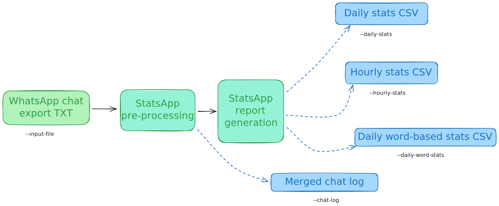

# StatsApp

[](https://hackclub.com/arcade)

StatsApp is a command-line tool that parses group chat export files from WhatsApp, and performs some data analysis, outputting CSV files that can be visualized in an app like [Flourish](https://flourish.studio/).

[**👉 Skip to the usage guide**](#usage-guide)

## Features

- Generates CSV data for daily message totals for a column chart or line graph, and hour-based message totals for generating "time card" diagrams
- Individual data points for each person, so that a specific person's data can be viewed
- Parses and filters special cases like deleted messages and polls
- Names can be customized to avoid leaking your embarrassing contact names
- Tested for large chat histories (190k+ messages)

## Design

### Input

The program accepts a `.txt` file that contains a chat history export from WhatsApp. You will need to extract it from the `.zip` file that WhatsApp generates.

### Pre-processing

WhatsApp formats dates and times in the export based on your phone's localization settings. StatsApp has been tested with the United Kingdom locale, and can handle either 12-hour or 24-hour time. If the program fails to parse an export from your phone, please open an issue so that we can add support for your locale!

If a configuration file is provided, it is used to rename contact names to make the data more consistent.

StatsApp recognizes and handles when chat exports contain text that isn't message content. For example, chat exports can have "media omitted", or "this message was deleted" placeholders. Deleted messages are excluded from most calculations.

### Output

StatsApp's main job is to create CSV reports that are written to a user-specified file. Any or all of the reports can be omitted from the command line arguments, in which case they won't be generated.

It can also generate a chat log with in the same format at the original export, but with the StatsApp's pre-processing applied. This can then be forwarded to a separate tool.

See [the output types section](#output-types) below for details.

## Output types

- Daily message counts (`--daily-stats`)
- Daily word counts (`--daily-word-stats`)
- Message counts by hour of the day + day of the week (`--hourly-stats`)
- Chat log (in the same format as the original export from WhatsApp) (`--chat-log`)
  - Includes "media omitted" lines
  - Excludes polls and deleted messages
  - Standardizes contact names using the config file

## Performance

Generates stats from **190k messages** (with all outputs enabled) in **1.71 seconds** on my machine (Intel i3-12100)

<!--
Test command: time yarn node dist/src/main.js --input data/WhatsApp\ Chat\ with\ -\ June\ 2024.txt --config dist/config/config.js --chat-log out/chat-log.txt --daily-stats out/daily-stats.csv --hourly-stats out/hourly.csv --daily-word-stats out/daily-words.csv
Result: 1.71s user 0.17s system 122% cpu 1.535 total
-->

## Limitations

- The chat export parser assumes that each message ends at the end of its line
  - This means that if a message has line breaks, only words before the first line break will be included in calculations
  - Because poll options appear across multiple lines in a chat export, this also means that any text in polls is ignored
- A message crafted in a particular way can trick the parser
  - For example, there's no way to differentiate between a deleted message, and a message with the exact content "This message was deleted"
  - This is a limitation of the text-based export format that WhatsApp provides

## Diagrams

<picture>
  <source media="(prefers-color-scheme: light)" srcset="./assets/statsapp-v0.2-light.excalidraw.svg">
  
</picture>

### Step 0: Installation

1. Clone this repository and change directory into its folder
2. Ensure you have a modern version of the Yarn package manager installed (see <https://yarnpkg.com/getting-started/install>)
3. Run `yarn` to install the dependencies for this program
4. Run `yarn run compile` to compile the TypeScript source code into executable JavaScript

### Step 1: Taking a WhatsApp chat export

Open the WhatsApp chat you want to generate statistics for on your phone. In the Android app, press the three dots in the top bar, press **More**, press **Export chat**, and select **Without media** in the popup.

WhatsApp will take some time to generate the export. Once its done, the share screen will pop up, and you can save the `.zip` file it produced by attaching it to a message to yourself, or any other method. Transfer the file to the computer running StatsApp. Finally, extract the `.zip` file so that you have the `.txt` chat export file.

### Step 2: Run StatsApp

Run the program at the command line like this:

```bash
yarn node dist/src/main.js <arguments>
```

#### Command-line arguments

- `--input [file]` (**required**) specifies the path to the chat export file
- `--config [file]` specifies a path to a JavaScript config file for StatsApp
- `--verbose` can be specified to make the program print more details of its processing
- `--daily-stats [file]`, `--hourly-stats [file]`, `--daily-word-stats [file]`, `--chat-log [file]` provide paths to output files, see [output types](#output-types)

### Step 3: Use the generated files

Upload the CSV output files to a data visualization platform like [Datawrapper](https://www.datawrapper.de) or [Flourish](https://flourish.studio/), use the processed chatlog to generate a [Chat Analytics](https://chatanalytics.app/) or [WhatsAnalyze](https://whatsanalyze.com/) report, or do some of your own data visualization. It's up to you!

## Development instructions

This is a Typescript + Node.js project that uses Yarn v4 for package management. After cloning the repository, install dependencies by running `yarn`.

Start the Typescript compiler in watch mode using `yarn run watch`

Enable additional debug logs when running the tool by setting the `--verbose` flag, e.g.

```bash
yarn node dist/src/main.js --verbose --input data/chat.txt --daily-stats out/daily-stats.csv --chat-log out/chat-log.txt
```

## AI usage statement

GitHub Copilot's inline completions have been used while writing code.
